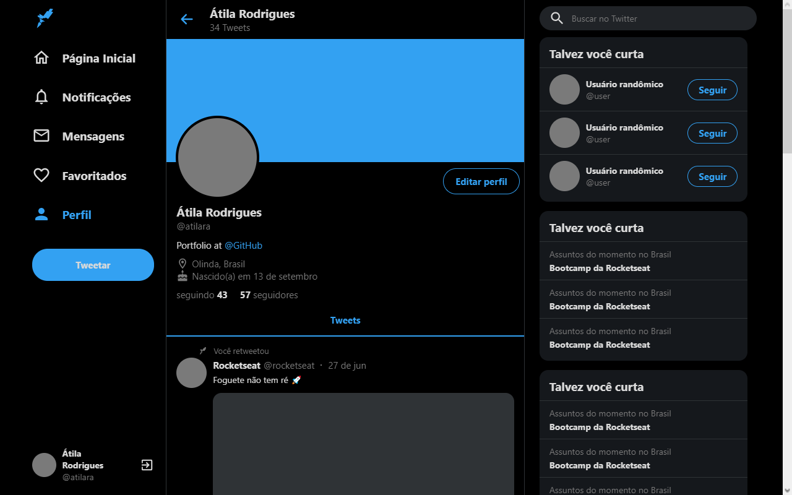
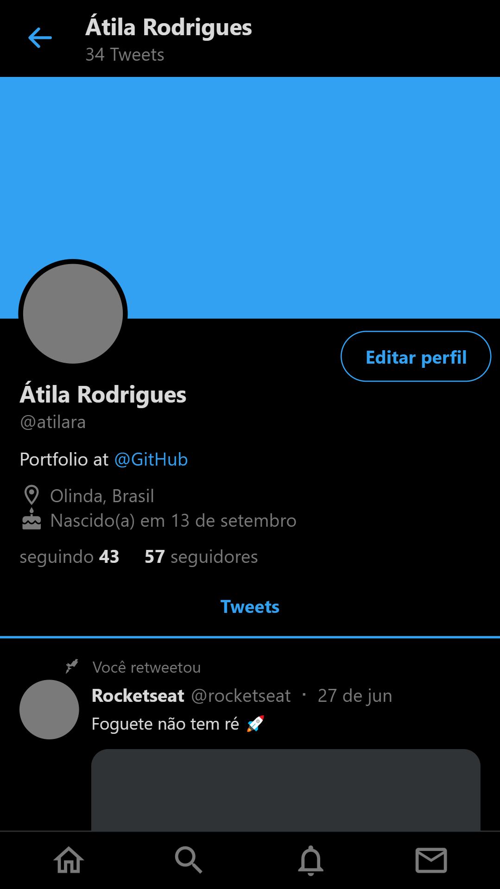

# 🐦 Twitter's UI Clone

## ℹ About

This clone was built for the purpose of studying, following this [video](https://www.youtube.com/watch?v=K-8z_4xvT3o).

## 🛠 Technologies and Concepts Studied

- ReactJS
- TypeScript
- Styled Components
- Responsive Websites

## 🖥 Desktop Interface

Desktop version of the website.



## 📱 Mobile Interface

Mobile version of the website.



## 🚀 Deploy

This website is being deployed using [Vercel](https://vercel.com) on this [link](https://ui-clone-twitter-coral.vercel.app).

## 👨‍💻 How to use

You need to have `node.js` in your machine and a package manager (`npm` or `yarn`) to interpret the code and install the dependencies.

```bash
# To install all the dependencies
$ yarn install

# To run the project
$ yarn start
```

## 📄 License

This repository is hosted under the MIT License.